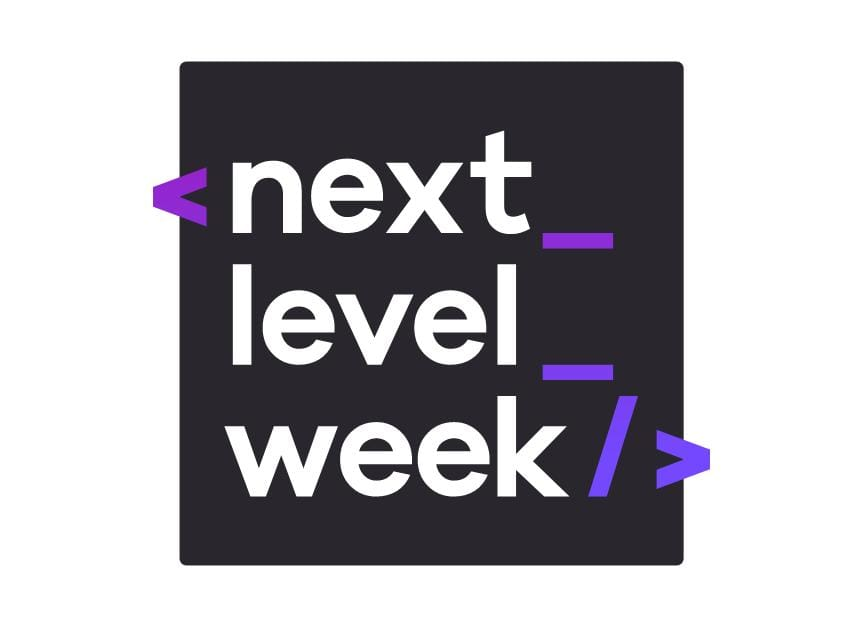

# Ecoleta

Este projeto é resultado da participação na 1ª edição da **Next Level Week**, promovida pela [Rockseat][1]. A propósta do bootcamp é desenvolver uma API RESTful com ![Node][node] e ![typescript][ts], um cliente web com ![ReactJS][react] e uma aplicação mobile multiplataforma com ![React Native][react-native]

  [1]: https://github.com/Rocketseat
  [node]: https://img.shields.io/static/v1?label=Node.js&logo=node.js&message=12.17.0&color=339933&link=https://nodejs.org/en/
  [ts]: https://img.shields.io/static/v1?label=Typescript&logo=typescript&message=3.9.3&color=007ACC&link=https://www.typescriptlang.org/
  [react]: https://img.shields.io/static/v1?label=React&logo=react&message=1&color=61DAFB&link=https://en.reactjs.org/
  [react-native]: https://img.shields.io/static/v1?label=React-Native&logo=react&message=1&color=blue&link=https://en.reactjs.org/

## Discussions

Next Level Week have a community in ![discord][discord]

Other subjects covered can be access in the respective page:
 - [Class 1](/discussion/NLW#1.md)

  [discord]: https://img.shields.io/static/v1?label&logo=discord&message=Discord&color=grey&link=https://discord.gg/JJsN5Mt
